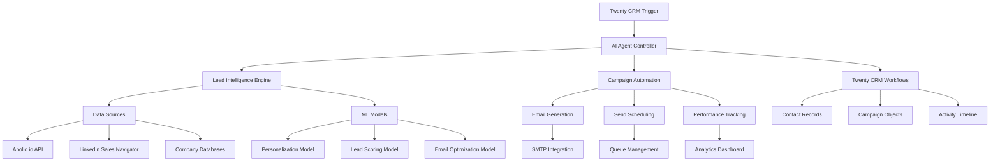

# EarthCare AI Agent - Product Requirements Document (PRD)

## Executive Summary

**Product Name**: EarthCare AI Agent  
**Version**: 1.0  
**Date**: September 2025  
**Status**: Draft  

### Vision Statement
Build an intelligent AI agent integrated into Twenty CRM that autonomously finds prospects, enriches contact data, and executes personalized email campaigns for EarthCare Network's business directory platform, matching the capabilities of Instantly.ai while leveraging Twenty CRM's open-source architecture.

### Success Metrics
- **Lead Generation**: 10,000+ qualified prospects found per month
- **Email Performance**: 25%+ open rates, 5%+ reply rates
- **Automation Efficiency**: 90% reduction in manual prospecting time
- **Revenue Impact**: 40% increase in new business inquiries through directory

---

## Problem Statement

### Current Challenges
1. **Manual Prospecting**: Sales team spends 60%+ time on manual lead research
2. **Data Fragmentation**: Contact information scattered across multiple tools
3. **Generic Outreach**: One-size-fits-all email campaigns with low engagement
4. **Poor Integration**: Existing tools don't integrate seamlessly with Twenty CRM
5. **High Costs**: Solutions like Instantly.ai cost $37-297/month per user

### Market Opportunity
- B2B email marketing industry: $10B+ annually
- 91% of B2B marketers use email for content distribution
- AI-powered sales tools growing at 30% CAGR
- Open-source CRM adoption increasing 40% year-over-year

---

## Solution Overview

### Core Concept
An AI-powered agent that lives within Twenty CRM, combining:
- **Lead Intelligence**: AI-driven prospect discovery and enrichment
- **Campaign Automation**: Multi-sequence email campaigns with smart personalization
- **CRM Integration**: Native Twenty CRM workflows and data synchronization
- **Performance Analytics**: Real-time campaign metrics and optimization

### Key Differentiators
1. **Native Integration**: Built directly into Twenty CRM's workflow system
2. **Open Source**: Fully customizable and cost-effective
3. **AI-First**: Advanced ML models for personalization and optimization
4. **Privacy-Focused**: Self-hosted data control and GDPR compliance
5. **EarthCare Specialized**: Optimized for sustainable business networking

---

## Technical Architecture

### System Components

#### 1. AI Lead Intelligence Engine
```typescript
interface LeadIntelligenceEngine {
  // Prospect Discovery
  findProspects(criteria: ProspectCriteria): Promise<Prospect[]>
  enrichContact(contact: Contact): Promise<EnrichedContact>
  validateEmail(email: string): Promise<ValidationResult>
  
  // Data Sources Integration
  integrateDataSource(source: DataSource): void
  searchSocialProfiles(name: string, company: string): SocialProfile[]
  getCompanyInsights(domain: string): CompanyInsights
}

interface ProspectCriteria {
  industry: string[]
  jobTitles: string[]
  companySize: string
  location: string[]
  technologies: string[]
  fundingStage?: string
  keywords?: string[]
}
```

#### 2. Campaign Automation System
```typescript
interface CampaignAutomation {
  // Campaign Management
  createCampaign(config: CampaignConfig): Promise<Campaign>
  scheduleCampaign(campaignId: string, schedule: Schedule): void
  pauseCampaign(campaignId: string): void
  
  // Email Generation
  generatePersonalizedEmail(prospect: Prospect, template: Template): Promise<Email>
  optimizeSubjectLine(content: string, recipient: Prospect): string
  validateEmailContent(email: Email): ValidationResult
  
  // Performance Tracking
  trackEmailMetrics(campaignId: string): CampaignMetrics
  optimizeSendTiming(recipient: Prospect): Date
}

interface CampaignConfig {
  name: string
  sequences: EmailSequence[]
  targeting: ProspectCriteria
  schedule: Schedule
  personalization: PersonalizationRules
  stopConditions: StopCondition[]
}
```

#### 3. Twenty CRM Integration Layer
```typescript
interface TwentyCRMIntegration {
  // Workflow Integration
  createWorkflowTrigger(trigger: WorkflowTrigger): void
  executeCustomAction(action: CustomAction): Promise<ActionResult>
  syncContactData(contacts: Contact[]): Promise<SyncResult>
  
  // Custom Objects
  createLeadObject(lead: Lead): Promise<ObjectCreationResult>
  updateCampaignObject(campaign: Campaign): Promise<UpdateResult>
  linkContactToCampaign(contactId: string, campaignId: string): void
  
  // API Integration
  callExternalAPI(endpoint: string, payload: any): Promise<APIResponse>
  handleWebhook(webhookData: WebhookPayload): void
}
```

### Data Flow Architecture



---

## Feature Specifications

### Phase 1: Core AI Agent (MVP)

#### Feature 1.1: Prospect Discovery
**User Story**: As a sales rep, I want the AI to find qualified prospects matching my ICP automatically.

**Acceptance Criteria**:
- [ ] AI searches 10+ data sources for prospects
- [ ] Applies customizable filtering criteria
- [ ] Returns 50+ qualified leads per search
- [ ] Validates email deliverability (95%+ accuracy)
- [ ] Enriches contacts with social profiles, company data
- [ ] Integrates with Twenty CRM's Contact object

**Technical Requirements**:
```typescript
// Custom Object: AI_Prospect
const AIProspectObject = {
  name: "AI_Prospect",
  fields: {
    firstName: { type: "text", required: true },
    lastName: { type: "text", required: true },
    email: { type: "email", required: true, validated: true },
    company: { type: "relation", object: "Company" },
    jobTitle: { type: "text" },
    linkedinUrl: { type: "url" },
    phoneNumber: { type: "phone" },
    aiScore: { type: "number", min: 0, max: 100 },
    dataSource: { type: "select", options: ["Apollo", "LinkedIn", "ZoomInfo"] },
    enrichmentStatus: { type: "select", options: ["Pending", "Complete", "Failed"] },
    lastEnriched: { type: "dateTime" }
  }
}
```

#### Feature 1.2: Email Campaign Automation
**User Story**: As a sales rep, I want AI to create and send personalized email sequences automatically.

**Acceptance Criteria**:
- [ ] Creates multi-step email sequences (3-7 emails)
- [ ] Personalizes content using prospect data
- [ ] Optimizes send timing based on recipient behavior
- [ ] Handles email deliverability and reputation
- [ ] Stops sequences on replies or unsubscribes
- [ ] Tracks opens, clicks, replies, and conversions

**Technical Implementation**:
```typescript
// Custom Object: AI_Campaign
const AICampaignObject = {
  name: "AI_Campaign",
  fields: {
    name: { type: "text", required: true },
    status: { type: "select", options: ["Draft", "Active", "Paused", "Completed"] },
    prospects: { type: "relation", object: "AI_Prospect", multiple: true },
    sequences: { type: "json" }, // Email sequence configuration
    metrics: { type: "json" }, // Campaign performance data
    createdBy: { type: "relation", object: "WorkspaceMember" },
    schedule: { type: "json" }, // Sending schedule
    stopConditions: { type: "json" }, // Auto-stop rules
    aiOptimizations: { type: "json" } // AI-suggested improvements
  }
}
```

#### Feature 1.3: Twenty CRM Workflow Integration
**User Story**: As an admin, I want the AI agent to trigger automatically based on CRM events.

**Workflow Triggers**:
1. **New Company Added** → Find decision makers
2. **Contact Updated** → Enrich with additional data
3. **Opportunity Created** → Generate warm introduction sequence
4. **Manual Launch** → Custom prospect research

**Workflow Actions**:
```typescript
// Custom Workflow Action: AI_FindProspects
const findProspectsAction = {
  name: "AI_FindProspects",
  description: "Use AI to find prospects matching criteria",
  inputs: {
    targetCompany: { type: "Company", required: false },
    jobTitles: { type: "multiSelect", options: ["CEO", "CTO", "VP Sales"] },
    industry: { type: "text" },
    companySize: { type: "select", options: ["1-10", "11-50", "51-200", "201+"] }
  },
  outputs: {
    prospectsFound: { type: "number" },
    prospects: { type: "AI_Prospect[]" }
  }
}

// Custom Workflow Action: AI_LaunchCampaign
const launchCampaignAction = {
  name: "AI_LaunchCampaign",
  description: "Launch personalized email campaign",
  inputs: {
    prospects: { type: "AI_Prospect[]", required: true },
    campaignTemplate: { type: "select", options: ["Warm Introduction", "Cold Outreach", "Follow-up"] },
    customMessage: { type: "longText" }
  },
  outputs: {
    campaignId: { type: "text" },
    emailsSent: { type: "number" },
    scheduledEmails: { type: "number" }
  }
}
```

### Phase 2: Advanced Intelligence (Q2 2025)

#### Feature 2.1: AI-Powered Personalization
- **Intent Signals**: Monitor prospect digital behavior
- **Company Triggers**: News, funding, hiring, technology changes
- **Dynamic Content**: Real-time email content optimization
- **A/B Testing**: Automated subject line and content testing

#### Feature 2.2: Conversation Intelligence
- **Reply Analysis**: AI categorizes and prioritizes responses
- **Sentiment Analysis**: Understands prospect engagement level
- **Next Best Action**: Suggests optimal follow-up strategies
- **Meeting Scheduling**: Automated calendar integration

#### Feature 2.3: Performance Optimization
- **Deliverability Management**: Email reputation monitoring
- **Send Time Optimization**: ML-powered timing prediction
- **List Cleaning**: Automatic bounce and unsubscribe handling
- **ROI Analytics**: Revenue attribution and forecasting

### Phase 3: Enterprise Features (Q4 2025)

#### Feature 3.1: Team Collaboration
- **Campaign Sharing**: Template library and best practices
- **Performance Benchmarking**: Team metrics and leaderboards
- **Lead Assignment**: Intelligent territory and account mapping
- **Approval Workflows**: Manager review for sensitive campaigns

#### Feature 3.2: Advanced Integrations
- **Social Selling**: LinkedIn and Twitter automation
- **Video Personalization**: AI-generated video messages
- **Phone Integration**: Warm call preparation and scripts
- **CRM Ecosystem**: Salesforce, HubSpot migration tools

---

## User Experience Design

### Primary User Personas

#### Persona 1: Sales Representative (Primary)
- **Goals**: Find qualified prospects, send personalized outreach, track engagement
- **Pain Points**: Manual research, low response rates, tool complexity
- **Usage**: Daily campaign management, prospect research, performance review

#### Persona 2: Sales Manager (Secondary)
- **Goals**: Team performance visibility, campaign approval, strategy optimization
- **Pain Points**: Lack of visibility, inconsistent messaging, ROI measurement
- **Usage**: Weekly team reviews, campaign template creation, analytics analysis

#### Persona 3: Marketing Manager (Secondary)
- **Goals**: Lead generation alignment, brand message consistency, demand generation
- **Pain Points**: Sales/marketing misalignment, message control, attribution
- **Usage**: Campaign template creation, brand guideline enforcement, lead scoring

### User Interface Design

#### Dashboard Layout
```
┌─────────────────────────────────────────────────────────────┐
│ EarthCare AI Agent Dashboard                               │
├─────────────────┬─────────────────┬─────────────────────────┤
│ Active Campaigns│ Prospect Queue  │ Performance Metrics     │
│ • Campaign A    │ • 47 New Leads  │ • 28% Open Rate        │
│ • Campaign B    │ • 12 Enriching  │ • 6% Reply Rate        │
│ • Campaign C    │ • 8 Failed      │ • 15 Meetings Booked   │
├─────────────────┼─────────────────┼─────────────────────────┤
│ Quick Actions   │ Recent Activity │ AI Recommendations     │
│ [Find Prospects]│ • Email sent    │ • Optimize send times  │
│ [New Campaign]  │ • Reply received│ • Update templates     │
│ [Bulk Enrich]   │ • Meeting booked│ • Clean email list     │
└─────────────────┴─────────────────┴─────────────────────────┘
```

#### Prospect Discovery Interface
```
┌─────────────────────────────────────────────────────────────┐
│ AI Prospect Finder                                         │
├─────────────────────────────────────────────────────────────┤
│ Natural Language Search:                                    │
│ "Find CTOs at B2B SaaS companies in SF with 50+ employees" │
│ [🔍 Search]                                                │
├─────────────────────────────────────────────────────────────┤
│ Advanced Filters:                                          │
│ Industry: [SaaS] [FinTech] [E-commerce]                   │
│ Title: [CTO] [VP Engineering] [Tech Lead]                 │
│ Company Size: [50-200 employees]                          │
│ Location: [San Francisco] [Remote]                        │
├─────────────────────────────────────────────────────────────┤
│ Results: 47 prospects found                                │
│ ┌─────────────────────────────────────────────────────────┐ │
│ │ John Smith, CTO @ TechCorp                             │ │
│ │ ✓ Email verified  📧 john@techcorp.com                │ │
│ │ 🏢 SaaS, 75 employees  📍 San Francisco               │ │
│ │ [Add to Campaign] [View Profile] [Enrich]             │ │
│ └─────────────────────────────────────────────────────────┘ │
└─────────────────────────────────────────────────────────────┘
```

---

## Technical Implementation Plan

### Architecture Decisions

#### 1. Technology Stack
```yaml
Backend:
  - Runtime: Node.js 18+
  - Framework: NestJS (aligns with Twenty CRM)
  - Database: PostgreSQL + Redis
  - Queue: Bull/BullMQ for job processing
  - AI/ML: OpenAI GPT-4, custom fine-tuned models

Frontend:
  - Framework: React 18 + TypeScript
  - UI Library: Twenty's existing design system
  - State Management: Recoil (Twenty's choice)
  - Build Tool: Vite

External Integrations:
  - Email: SMTP + SendGrid/Mailgun
  - Data Sources: Apollo.io, ZoomInfo, Clearbit
  - AI Services: OpenAI, Anthropic Claude
  - Monitoring: Sentry, DataDog
```

#### 2. Database Schema

```sql
-- AI Agent Tables
CREATE TABLE ai_prospects (
  id UUID PRIMARY KEY DEFAULT gen_random_uuid(),
  workspace_id UUID NOT NULL REFERENCES workspace(id),
  first_name VARCHAR(255) NOT NULL,
  last_name VARCHAR(255) NOT NULL,
  email VARCHAR(255) NOT NULL,
  company_id UUID REFERENCES company(id),
  job_title VARCHAR(255),
  linkedin_url VARCHAR(500),
  phone_number VARCHAR(50),
  ai_score INTEGER DEFAULT 0,
  data_source VARCHAR(100),
  enrichment_status VARCHAR(50) DEFAULT 'pending',
  enrichment_data JSONB,
  created_at TIMESTAMP DEFAULT NOW(),
  updated_at TIMESTAMP DEFAULT NOW()
);

CREATE TABLE ai_campaigns (
  id UUID PRIMARY KEY DEFAULT gen_random_uuid(),
  workspace_id UUID NOT NULL REFERENCES workspace(id),
  name VARCHAR(255) NOT NULL,
  status VARCHAR(50) DEFAULT 'draft',
  sequences JSONB NOT NULL,
  targeting_criteria JSONB,
  schedule_config JSONB,
  metrics JSONB DEFAULT '{}',
  created_by UUID REFERENCES workspace_member(id),
  created_at TIMESTAMP DEFAULT NOW(),
  updated_at TIMESTAMP DEFAULT NOW()
);

CREATE TABLE ai_campaign_prospects (
  id UUID PRIMARY KEY DEFAULT gen_random_uuid(),
  campaign_id UUID NOT NULL REFERENCES ai_campaigns(id),
  prospect_id UUID NOT NULL REFERENCES ai_prospects(id),
  status VARCHAR(50) DEFAULT 'pending',
  current_sequence_step INTEGER DEFAULT 0,
  last_email_sent TIMESTAMP,
  next_email_scheduled TIMESTAMP,
  engagement_data JSONB DEFAULT '{}',
  created_at TIMESTAMP DEFAULT NOW()
);

CREATE TABLE ai_email_tracking (
  id UUID PRIMARY KEY DEFAULT gen_random_uuid(),
  campaign_prospect_id UUID NOT NULL REFERENCES ai_campaign_prospects(id),
  email_subject VARCHAR(500),
  email_content TEXT,
  sent_at TIMESTAMP,
  opened_at TIMESTAMP,
  clicked_at TIMESTAMP,
  replied_at TIMESTAMP,
  bounced_at TIMESTAMP,
  tracking_data JSONB DEFAULT '{}'
);
```

#### 3. API Design

```typescript
// AI Agent API Routes
@Controller('ai-agent')
export class AIAgentController {
  
  @Post('prospects/search')
  async searchProspects(@Body() criteria: ProspectCriteria): Promise<Prospect[]> {
    // Implement prospect discovery logic
  }
  
  @Post('prospects/:id/enrich')
  async enrichProspect(@Param('id') prospectId: string): Promise<EnrichedProspect> {
    // Implement data enrichment logic
  }
  
  @Post('campaigns')
  async createCampaign(@Body() config: CampaignConfig): Promise<Campaign> {
    // Implement campaign creation logic
  }
  
  @Post('campaigns/:id/launch')
  async launchCampaign(@Param('id') campaignId: string): Promise<LaunchResult> {
    // Implement campaign launch logic
  }
  
  @Get('campaigns/:id/metrics')
  async getCampaignMetrics(@Param('id') campaignId: string): Promise<CampaignMetrics> {
    // Implement metrics retrieval logic
  }
}

// Twenty CRM Integration
@Controller('twenty-integration')
export class TwentyIntegrationController {
  
  @Post('webhooks/record-created')
  async handleRecordCreated(@Body() webhook: RecordCreatedWebhook): Promise<void> {
    // Handle Twenty CRM record creation triggers
  }
  
  @Post('workflows/find-prospects')
  async workflowFindProspects(@Body() input: WorkflowInput): Promise<WorkflowOutput> {
    // Custom workflow action implementation
  }
  
  @Post('workflows/launch-campaign')
  async workflowLaunchCampaign(@Body() input: WorkflowInput): Promise<WorkflowOutput> {
    // Custom workflow action implementation
  }
}
```

### Development Phases

#### Phase 1: Foundation (Weeks 1-4)
- [ ] **Week 1**: Set up development environment and architecture
- [ ] **Week 2**: Implement basic prospect discovery API
- [ ] **Week 3**: Create Twenty CRM custom objects and workflows
- [ ] **Week 4**: Build MVP dashboard and basic UI

#### Phase 2: Core Features (Weeks 5-8)
- [ ] **Week 5**: Implement email campaign automation engine
- [ ] **Week 6**: Add AI personalization and content generation
- [ ] **Week 7**: Integrate external data sources (Apollo.io, etc.)
- [ ] **Week 8**: Build comprehensive testing and QA

#### Phase 3: Integration & Polish (Weeks 9-12)
- [ ] **Week 9**: Complete Twenty CRM workflow integration
- [ ] **Week 10**: Implement analytics and performance tracking
- [ ] **Week 11**: User testing and feedback implementation
- [ ] **Week 12**: Production deployment and documentation

---

## Success Criteria & Metrics

### Key Performance Indicators (KPIs)

#### Business Metrics
1. **Lead Generation Volume**
   - Target: 10,000+ qualified prospects/month
   - Measurement: AI_prospects table count
   
2. **Email Performance**
   - Target: 25%+ open rate, 5%+ reply rate
   - Measurement: ai_email_tracking analytics
   
3. **Time Savings**
   - Target: 90% reduction in manual prospecting
   - Measurement: User activity tracking
   
4. **Revenue Impact**
   - Target: 40% increase in new business inquiries
   - Measurement: Opportunity creation from AI campaigns

#### Technical Metrics
1. **System Performance**
   - API